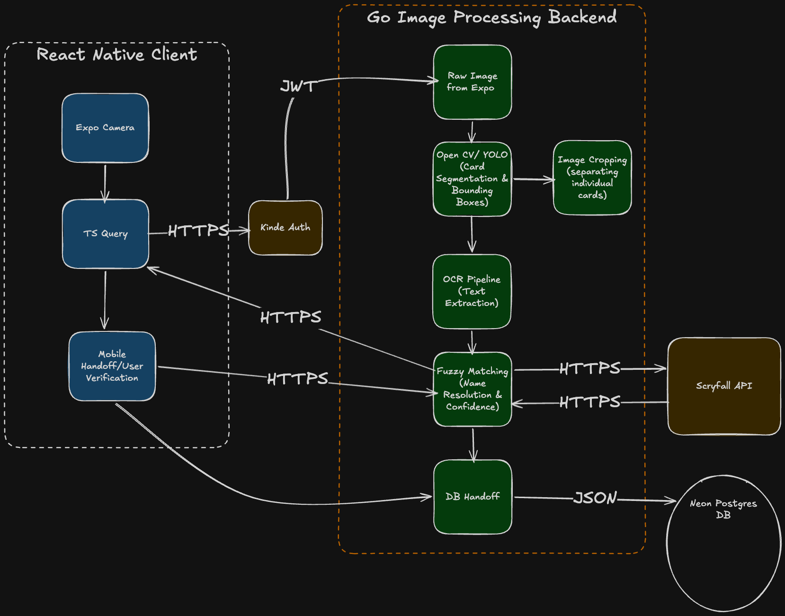

# Paper Bauble

Paper Bauble is a mobile application and backend system designed to scan physical cards, extract text using OCR, and identify them through fuzzy matching against the scryfall card database. Eventually we will be using AI/ML help to identify cards and provide deck analysis.

## System Design

The following diagram illustrates the high-level architecture of the system, from the mobile client capture to the backend processing pipeline.

## Project Structure

- **apps/api**: A Go-based REST API that handles image uploads, performs OCR using Tesseract, and manages database interactions.
- **apps/mobile**: A React Native application built with Expo for capturing card images and interacting with the backend.

## Tech Stack

- **Frontend**: React Native, Expo, TypeScript
- **Backend**: Go, Tesseract OCR (`gosseract`), PostgreSQL (Neon)
- **Infrastructure**: Render (API Hosting), Neon (Managed Postgres)

## Development

Refer to the individual `README.md` files within the `apps/api` and `apps/mobile` directories for specific setup and development instructions.
